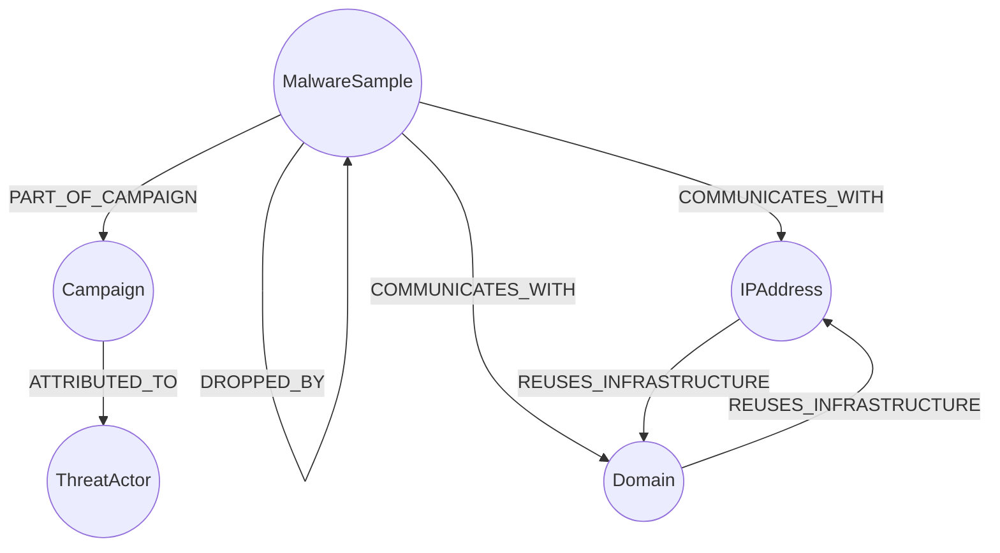
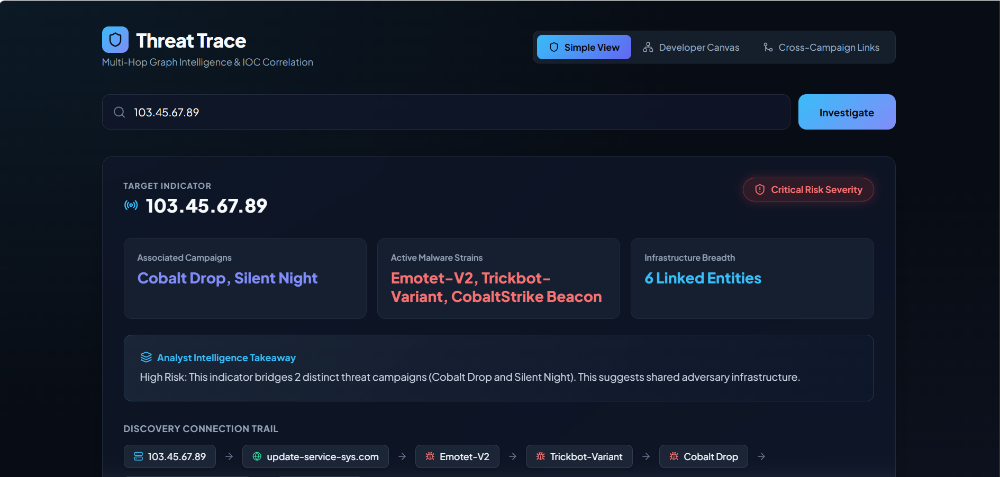
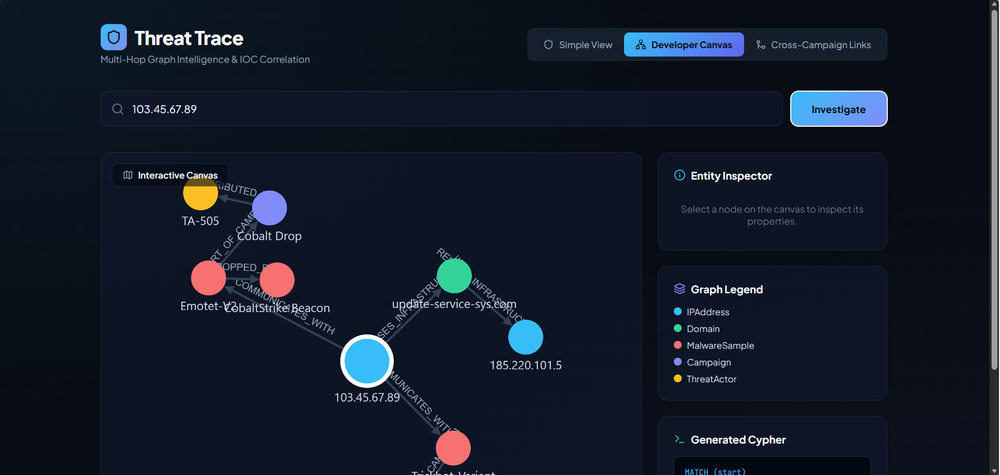
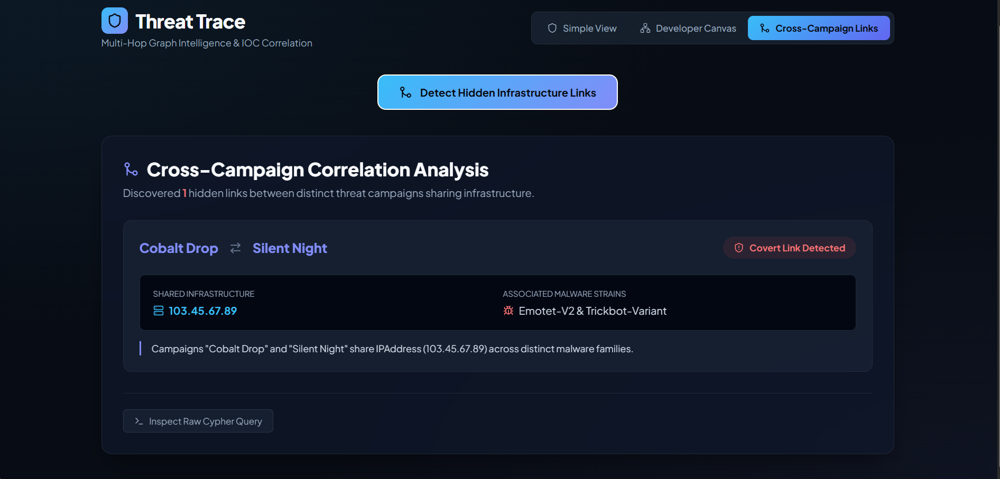

# Threat Trace: IOC Correlation Intelligence

**Threat Trace** is a full-stack web application designed for cybersecurity analysts. It allows users to investigate suspicious indicators of compromise (IPs, domains, hashes) and discover multi-hop links to hidden campaigns, malware, and shared infrastructure that wouldn't be obvious from looking at any single record.

### Links & Deliverables
*   **Live Demo:** https://threat-trace-eight.vercel.app/

*   **Screen Recording:** (

https://github.com/user-attachments/assets/42301b71-f456-42f3-ae13-a2b04f155b1e

)

*   **GitHub Repository:** https://github.com/HackCyber007/threat-trace

---
##  Demo Dataset & Test Indicators

To provide a deterministic and stable environment for evaluating the graph data model, this deployment runs on a pre-seeded threat intelligence graph stored in CognoDB rather than live external API feeds.

Use the curated Indicators of Compromise (IoCs) below to test multi-hop traversals and cross-campaign correlations:

| Type | Test Value 

| **IP Address** | `103.45.67.89` 

| **IP Address** | `185.220.101.5` 

| **Domain** | `update-service-sys.com`

| **Domain** | `cdn-cloud-storage.net` 

| **Malware Hash** | `e3b0c44298fc1c14`

> **Note:** Entering values outside the seeded graph will return a clean "No Threat Indicators Found" state, demonstrating proper empty-state handling.

---

## 1. Why a Graph Database over SQL?

In a traditional relational database, modeling threat intelligence requires rigid schemas and computationally expensive `JOIN` operations. Finding a hidden link between two campaigns that share infrastructure would require knowing the exact depth of the connection beforehand, or writing heavily nested, recursive SQL that brings the database to a crawl.

Graph databases treat **relationships** as first-class citizens, which provides massive advantages for this use case:
*   **Variable-Depth Traversal:** Cypher can easily query variable depths (e.g., `-[*1..4]-`) to find connections up to 4 hops away, discovering links analysts didn't know to look for.
*   **Performance:** Traversing a pre-calculated edge in a graph is generally an O(1) memory pointer operation, making complex cross-campaign correlation vastly faster than SQL index lookups.

---

## 2. Data Model

Below is the graph schema modeling our threat intelligence ecosystem. 



**Node Properties include:**

* `Campaign`: id, name, first_seen, confidence_score
* `MalwareSample`: id, hash, family, file_type
* `IPAddress`: id, address, asn, country
* `Domain`: id, domain, registrar, first_seen

---

## 3. Creating a CognoDB Instance

To run this application, you need a CognoDB database. Follow these steps to provision a free instance:

1. **Sign up:** Go to `https://console.cognodb.com/signup` and create an account (no credit card required).
2. **Create instance:** From the console, create a free (c0) instance and select a region. It will provision in under a minute.
3. **Save credentials:** You will receive a connection URI (`bolt+s://<instance-id>.databases.cognodb.cloud`) and a generated password for the user "cognodb". The password is shown exactly once, so copy it immediately.

---

## 4. Local Setup & Run Instructions

**Prerequisites:** Node.js (v18+)

### Step 1: Backend Setup & Database Seeding

1. Navigate to the backend directory: `cd backend`
2. Install dependencies: `npm install`
3. Create your environment file: `cp .env.example .env`
4. Update the `.env` file with your CognoDB URI and password. (The username is `cognodb` by default).
5. Run the seed script to wipe the database and load the realistic threat data:
`node seed/seed.js`
6. Start the API server:
`node src/server.js` (Runs on `http://localhost:5000`)

### Step 2: Frontend Setup

1. Open a new terminal and navigate to the frontend directory: `cd frontend`
2. Install dependencies: `npm install`
3. Start the Vite development server: `npm run dev`
4. Open the provided localhost URL (usually `http://localhost:5173`) in your browser.

---

## 5. Main Cypher Queries Explained

The backend interacts with CognoDB entirely through parameterized queries using the official Neo4j JavaScript driver.

**1. The Multi-Hop Traversal (Indicator Search)**
This query drives both the Simple View and Developer Canvas. It matches a start node by an indicator string, and traverses up to 3 hops outward along *any* relationship type to return the entire graph "blast radius."

```cypher
MATCH (start)
WHERE start.address = $indicator 
   OR start.domain = $indicator 
   OR start.hash = $indicator
OPTIONAL MATCH path = (start)-[*1..3]-(connected)
RETURN start, collect(DISTINCT path) AS paths

```

**2. The "SQL-Awkward" Query (Hidden Links Analysis)**
This query fulfills the requirement for a query that relational databases would find awkward. It looks for two distinct, unrelated `Campaign` nodes that inadvertently share intermediate infrastructure (an IP or Domain) through different malware variants.

```cypher
MATCH (c1:Campaign)<-[:PART_OF_CAMPAIGN]-(m1:MalwareSample)-[:COMMUNICATES_WITH]->(infra)<-[:COMMUNICATES_WITH]-(m2:MalwareSample)-[:PART_OF_CAMPAIGN]->(c2:Campaign)
WHERE c1.id < c2.id AND m1 <> m2
RETURN 
  c1.name AS campaignA,
  c2.name AS campaignB,
  labels(infra)[0] AS infraType,
  coalesce(infra.address, infra.domain) AS sharedValue,
  m1.family AS malwareA,
  m2.family AS malwareB

```

---

## 6. Screenshots

### Simple View (Analyst Summary)




### Developer Canvas (Force-Directed Graph)




### Hidden Links Analysis





```


